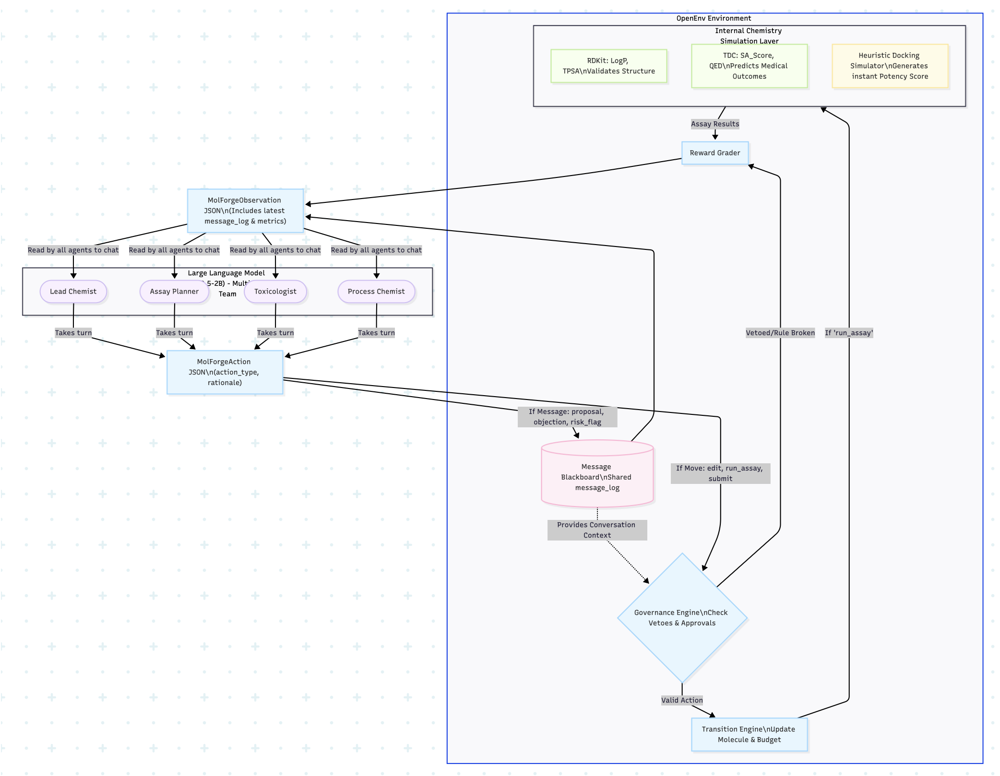
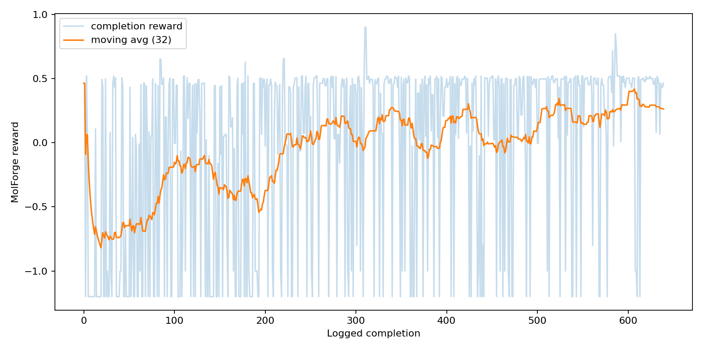
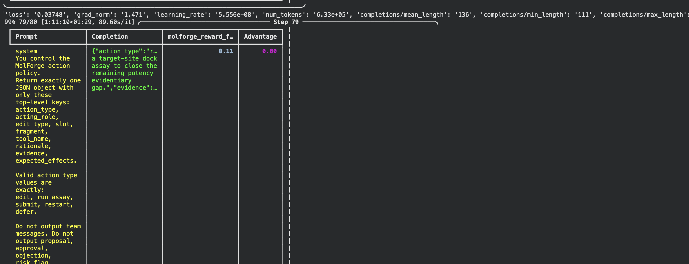

# MolForge: Verifier-Driven RL for Drug Discovery

MolForge is a reinforcement learning environment that simulates a **medical oncology discovery lab**. Unlike traditional LLM tasks where the model generates a final answer in one shot, MolForge forces the model to execute the **scientific method** under real-world constraints: budget, toxicity, and synthesis complexity.

**[View the MolForge Space Deployment on Hugging Face](https://huggingface.co/spaces/Adhitya122/molforge)**  
**[Try the RL Training Notebook on Google Colab](https://colab.research.google.com/drive/1c6npGkGNbbbd8XFNeS6zInBpopLnJ4W4?usp=sharing)**

### 🎥 Explainer Video
[](https://youtu.be/q8YoA0YhIn8)

### The Scientific Method as a Workflow


Imagine a biotech team tasked with optimizing a lead candidate for **KRAS G12C** (including a high-difficulty resistance panel). The model doesn't just "write" a molecule; it controls a specialist team that must navigate a resource-constrained laboratory:

- **Lead Chemist**: Proposes molecular edits and decides when to submit.
- **Assay Planner**: Allocates limited budget to run empirical tests.
- **Toxicologist**: Reviews safety risks and can object to unsafe designs.
- **Process Chemist**: Evaluates whether the molecule is practical to synthesize.

Every action—editing a fragment, running a docking simulation, or ordering a toxicity assay—is a decision that impacts the final outcome. The model must learn to gather enough evidence to justify a submission while keeping the project within budget.

> **Core Philosophy:** The LLM is not the judge. The LLM is the scientist being judged by external, verifiable reality.


## What Makes MolForge Special?

MolForge is built to move beyond simple "molecule generation" into "scientific workflow optimization." Here are the seven core pillars that make it unique:

1. [**Verifier-Based Evaluation**](#1-verifier-based-evaluation): The LLM is the scientist, not the judge. It is held accountable by real-world verifiers like **RDKit** and **TDC**.
2. [**Chemical & Molecular Simulations**](#2-chemical--molecular-simulations): Realistic simulation of potency and existence using heuristic docking, **RDKit**, and **TDC**.
3. [**Self-Correction & Improvement Loop**](#3-self-correction--improvement-loop): After each edit, agents receive structured feedback from verifiers, allowing them to self-correct.
4. [**Decomposed Reward Architecture**](#4-decomposed-reward-architecture): Multi-step rewards for every action (research, edits, coordination) provide high observability.
5. [**Scientific Model Improvement**](#5-scientific-model-improvement): Real verifier feedback (Reviews) guides the model toward scientifically sound designs.
6. [**Strategic Training Modes**](#6-strategic-training-modes): A dual-mode system using **Curriculum mode** (partial credit) and **Assay-Gated mode** (strict).
7. [**Multi-Agent Governance**](#7-multi-agent-governance): A specialized team that plans, executes, and shares information to coordinate the next plan of action.

---


## Architecture

The architecture is a closed scientific feedback loop:



### The POMDP Framework: Hidden vs. Visible State
MolForge is designed as a **partially observable Markov decision process (POMDP)**. This separation is what makes the environment a scientific challenge rather than a simple optimization task.

- **Hidden State**: The simulator tracks the ground-truth scoring for `potency`, `safety`, and `synthesizability`. It also hides "sunk-cost traps" and late-stage target mutation shifts (e.g., in `level_2_hard`) that the agent must discover through evidence.
- **Visible State**: The agent only sees noisy `MolForgeObservation` reports: pipeline history, SMILES scaffolds, remaining budget, and the structured feedback from the verifier assays (RDKit and TDC).

## Scientific Verifier Layers

### RDKit: chemical plausibility

RDKit checks molecule-like behavior and chemistry descriptors. In MolForge, this layer is used to keep the molecule edits grounded in chemical reality. It supports descriptor-style reasoning such as lipophilicity, polarity, tractability, and drug-likeness.

### TDC: biomedical outcome signals

Therapeutics Data Commons represents the medical outcome side of the environment. It provides the project with a path toward realistic prediction tasks such as toxicity, synthesis difficulty, and drug-likeness. In the default Docker deployment, RDKit remains active and TDC is optional because it can pull a heavier platform-sensitive ML stack.

### Heuristic docking: receptor fit

MolForge includes a docking-style surrogate that answers three fast questions:

| Check | Question | Why it matters |
| --- | --- | --- |
| Pocket matching | Does the hinge fragment fit the receptor pocket? | Better pocket complementarity improves potency. |
| Lipophilic match | Is LogP near the target pocket's hydrophobic comfort zone around `3.0`? | Too much lipophilicity can increase toxicity; too little can weaken binding. |
| Polarity match | Is TPSA near a useful range around `85.0`? | Polarity affects binding, permeability, and clash risk. |

This gives the environment fast receptor-aware feedback in milliseconds, which is important for RL.

## Training Story

The training pipeline has two stages:

1. **SFT warm start**
2. **RL with verifier rewards**

### Base model

The model used for the main run is:

```text
unsloth/Qwen3.5-2B
```

The raw base model was not reliable enough for the environment at first. It often failed to produce the exact structured JSON actions that MolForge expects, and it did not consistently respect the specialist-agent interaction format.

So the first step was a small SFT warm start. This stage is not meant to teach the model the optimal chemistry. It teaches the model how to speak the environment's action language:

- valid JSON actions
- correct role/action pairing
- correct molecule slots and fragments
- concise rationales
- evidence fields based only on visible observations
- expected-effect fields such as potency up/down or toxicity up/down
- valid specialist messages where needed

### Training Results
After SFT, the policy is trained with GRPO-style RL against MolForge itself. During training, the model explores the 256-combination molecular edit space, receiving rewards for molecule quality, evidence coverage, and budget discipline.




### Performance Comparison: SFT vs. RL

| Difficulty | Before (SFT Model) | After RL Training | Improvement |
| :--- | :---: | :---: | :---: |
| **Easy** | 0.1167 | 0.1295 | **+10.9%** |
| **Medium** | 0.1167 | 0.1278 | **+9.5%** |
| **Hard** | 0.0800 | 0.0866 | **+8.3%** |

As shown in the reward curve and logs, the model successfully learns to navigate the scientific constraints, moving from early exploration to consistent, verifier-backed molecule submissions. For strict evaluation, the environment switches back to `assay_gated` mode.


## Reward Design: Shaping Scientific Behavior

The reward function mixes coarse shaping with sparse terminal bonuses to promote rigorous scientific exploration:

- **Coarse Feedback**: Edit feedback avoids exposing exact hidden deltas, forcing the model to rely on assays for decision-making.
- **Information Gain**: Rewards for running useful assays that provide new, evidence-based signal.
- **Coordination & Governance**: Rewards for correct specialist reviews, proposal discipline, and multi-agent consensus.
- **Scientific Penalties**: Deductions for invalid actions, repeated states, wasteful assay repetition, and submitting without sufficient potency/safety support.
- **Terminal Scoring**: A large bonus for submitting a molecule that beats the baseline while satisfying all hard constraints.

### Strategic Training Modes

MolForge uses two distinct reward settings to balance training and evaluation:

1. **Curriculum Mode (Training)**: Adds bounded warmup rewards for evidence collection and "near-miss" episodes. It also adds a small **missed-nomination penalty** when a strong evidence package is ready but the agent lets the deadline pass without submitting. This acts as "breadcrumbs" for RL, helping smaller models navigate sparse reward landscapes.
2. **Assay-Gated Mode (Evaluation)**: The strict, official hackathon mode. If the agent does not formally `submit` the candidate before the budget is exhausted, the final score is exactly `0.0`. No partial credit is given for just gathering evidence.

`final_score` remains the single headline scalar for RL/evaluation. While `candidate_score` and `progress_score` are used for diagnostic observability, the environment is designed so that evidence collection alone cannot look like success; it must lead to a valid submission.


## Why This Project Matters

MolForge is designed to test a deeper kind of AI capability than simple answer generation. The model must work inside a scientific feedback loop where actions are checked, evidence costs money, unsafe decisions can be blocked, and the final answer only matters if the path to that answer is experimentally justified.

The strongest part of the project is that the LLM is not trusted by default. It has to earn trust through verifier-backed decisions.

## Deep Dive: What Makes MolForge Special?

### 1. Verifier-Based Evaluation
In many LLM systems, the model itself is used as a judge, reviewer, or evaluator. MolForge flips that pattern. The LLM is the scientist being judged, not the judge. It is held accountable by real-world verifiers like **RDKit**, **TDC**, and molecular simulation engines. This ensures that the model's progress is grounded in chemical and biological reality, not just persuasive language.

### 2. Chemical & Molecular Simulations
MolForge doesn't just predict outcomes; it utilizes multiple simulation layers to ground the model's decisions:
*   **Chemical Plausibility (RDKit):** Decides if the molecule generated by the LLM (via edits) can actually exist in chemical reality. [Visit RDKit](https://www.rdkit.org)
*   **Medical Outcomes (TDC):** Predicts the most probable medical outcomes and properties using the [Therapeutics Data Commons](https://tdcommons.ai).
*   **Heuristic Docking Score:** A fast, physics-inspired simulation that updates **potency** in milliseconds based on three rules:
    1.  **Pocket Matching:** Does the fragment structurally fit the target receptor pocket (e.g., KRAS G12C)?
    2.  **Lipophilic Match:** Is the LogP near the ideal **3.0** to sit comfortably in the hydrophobic pocket?
    3.  **Polarity Match:** Is the TPSA near the ideal **85.0** to avoid repulsive polar clashes?

### 3. Self-Correction & Improvement Loop
MolForge is an iterative environment. After each proposed molecular modification, the model receives a structured review from the verifiers. This feedback allows the agent to recognize liabilities (like toxicity or low potency) and correct them in the next step. This creates a genuine **self-improvement loop** within each episode.

### 4. Decomposed Reward Architecture
The reward function is not a single "black box" scalar. We use a multi-step reward system where small-scale rewards are designed for every individual action—research, molecular edits, and inter-agent coordination. While we may output a single total reward for training simplicity (especially for the hackathon), the decomposed components allow for massive observability into which sections of the workflow are lacking.

### 5. Scientific Model Improvement
We use real verifier feedback to drive model improvement. By providing constant, verifiable reviews, we train the model to improve its designs based on evidence. This moves the model away from simple pattern matching and toward a more rigorous, evidence-based design process.

### 6. Strategic Training Modes: Curriculum vs. Assay-Gated
To solve the "sparse reward" problem common in RL, MolForge uses two distinct modes:
*   **Curriculum Mode (Training):** If a model fails to submit but showed good scientific behavior, it receives "Partial Credit" (up to +0.75). It gets points for gathering evidence and designing promising molecules. These "breadcrumbs" teach the model how to explore before it discovers the terminal submission bonus.
*   **Assay-Gated Mode (Evaluation):** This is the strict, official mode used for hackathon grading. There is **zero partial credit**. If the model fails to explicitly `submit` a high-potency, safe molecule before the budget runs out, its score is exactly `0.0`.

### 7. Multi-Agent Governance
Drug discovery is a team effort. MolForge implements a multi-agent system where specialized roles (Lead Chemist, Toxicologist, Assay Planner) review each other's moves, plans, and executions. Crucially, these agents **share information and coordinate** between themselves to decide the next plan of action, ensuring that every decision undergoes a rigorous "peer review" process before execution.

---

## Final Takeaway

MolForge is special because it treats the LLM as a trainable research agent inside a controlled scientific environment, not as an oracle. The model is judged by chemistry and biomedical verifiers, corrected by specialist feedback, constrained by assay budget, and scored by a reward system that can explain where the policy succeeded or failed.

The important pieces work together:

- **Verifier-first evaluation:** RDKit, TDC-style signals, and docking-style simulation judge the model's actions.
- **Multi-agent review:** specialist roles create checks and balances around each decision.
- **Self-improvement loop:** every action produces feedback that the next action can respond to.
- **Decomposed rewards:** the environment tracks molecule quality, evidence, budget, coordination, and safety separately.
- **Curriculum to strict evaluation:** training can use partial-credit breadcrumbs, while final evaluation remains unforgiving.
- **Dynamic molecular search:** the model explores 256 fragment combinations across three starting scientific scenarios instead of memorizing one answer.

That is the project thesis: useful scientific agents should not merely generate plausible ideas. They should operate in a loop where the world pushes back.
